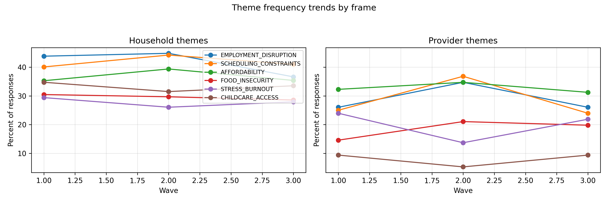
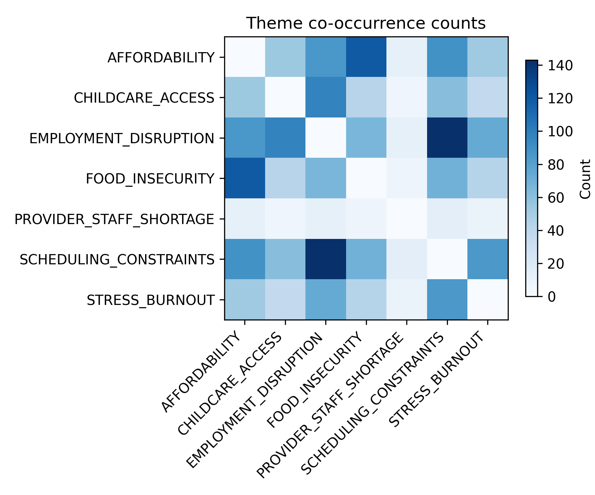
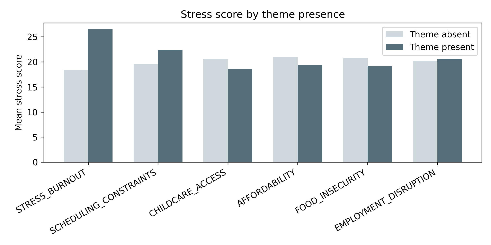

# Qualitative Survey Coding & Mixed-Methods Analysis


*Synthetic RAPID-style pipeline that turns messy open-ended survey responses into policy-ready mixed-methods evidence in minutes.*

## What this project is
This repo is a portfolio-grade qualitative analytics stack: a deterministic data generator, transparent rule-based codebook, mixed-methods metrics, reliability simulation, and publication-ready exports (brief + fact sheet) for childcare and workforce policy contexts.

## Why it matters
- Policy teams rarely have time to code thousands of open-ended responses—this workflow shows how to scale rigor while keeping transparency front-and-center.
- Mixed-methods deltas (stress, food insecurity, closure risk) bridge dashboard KPIs with the “why” contained in family/provider quotes.
- Reliability simulation and reproducible exports make it easy for reviewers or hiring committees to validate the approach with no hidden steps.

## What it produces (artifacts table)
| Artifact | Description |
| --- | --- |
| [qualitative_mixed_methods/data/outputs/mixed_methods_summary.csv](qualitative_mixed_methods/data/outputs/mixed_methods_summary.csv) | Theme-by-theme stress, food insecurity, and closure risk deltas (per frame + wave). |
| [qualitative_mixed_methods/data/outputs/reliability_by_theme.csv](qualitative_mixed_methods/data/outputs/reliability_by_theme.csv) | Percent agreement + Cohen’s κ from simulated second coder. |
| [qualitative_mixed_methods/reports/qual_factsheet_latest.html](qualitative_mixed_methods/reports/qual_factsheet_latest.html) | One-page fact sheet with findings, quotes, reliability table, and embedded figures. |
| [qualitative_mixed_methods/docs/qualitative_brief.md](qualitative_mixed_methods/docs/qualitative_brief.md) | Narrative memo summarizing dominant themes, exemplars, and mixed-methods highlights. |
| [qualitative_mixed_methods/scripts/export_demo_assets.py](qualitative_mixed_methods/scripts/export_demo_assets.py) | CLI utility that rebuilds the project with a smaller sample and copies assets for offline review. |
| [.github/workflows/ci.yml](qualitative_mixed_methods/.github/workflows/ci.yml) | GitHub Actions workflow that runs the pipeline + pytest on every push/PR. |

## Demo (no-install viewing)
Quick demo for reviewers (files live in `docs/demo/` and open in any browser or spreadsheet):
1. **Fact sheet:** double-click [docs/demo/qual_factsheet_latest.html](qualitative_mixed_methods/docs/demo/qual_factsheet_latest.html) to see figures + key findings.
2. **Narrative brief:** read [docs/demo/qualitative_brief.md](qualitative_mixed_methods/docs/demo/qualitative_brief.md) for plain-language context.
3. **Reliability table:** inspect [docs/demo/reliability_by_theme.csv](qualitative_mixed_methods/docs/demo/reliability_by_theme.csv) to confirm agreement metrics.

## How to run locally
```bash
cd qualitative_mixed_methods
python -m venv .venv
.venv\Scripts\activate        # use source .venv/bin/activate on macOS/Linux
pip install -r requirements.txt
python src/run_pipeline.py --responses 2000 --waves 3 --seed 42
python scripts/export_demo_assets.py
pytest -q
```

## Methodology
- **Qualitative coding:** deterministic codebook in `src/codebook.py` feeds `src/apply_coding.py`, producing both long and wide tables with multi-label assignments plus curated exemplar quotes.
- **Theme co-occurrence:** pairwise counts + normalized rates power the heatmap and narrative insights.
- **Mixed-methods layer:** `src/mixed_methods.py` simulates correlated quantitative indicators (stress score, food insecurity, employment/closure risk) and compares theme-present vs. absent groups.
- **Reliability simulation:** `src/reliability.py` mimics a second coder with controlled flip rates and outputs percent agreement + Cohen’s κ, with markdown narrative for briefs/fact sheets.

## Outputs gallery




Custom screenshots for decks or portfolios can be dropped into [docs/screenshots](qualitative_mixed_methods/docs/screenshots) (placeholder `.gitkeep` included so the folder stays tracked).

## Repo structure
```
qualitative_mixed_methods/
├── data/
│   ├── raw/ (synthetic survey responses)
│   ├── processed/ (coded_responses_wide/long, theme counts)
│   └── outputs/ (co-occurrence, exemplars, mixed-methods, reliability, demo bundles)
├── docs/
│   ├── demo/ (fact sheet, brief, reliability CSV, figures)
│   ├── qualitative_brief.md
│   └── screenshots/
├── reports/
│   ├── figures/
│   ├── factsheet_assets/
│   └── qual_factsheet_latest.html
├── scripts/
│   └── export_demo_assets.py
├── src/ (data gen, coding, reliability, viz, reporting)
├── templates/ (Jinja2 fact sheet)
└── tests/
```

## Testing & CI
- `pytest -q` exercises data generation, preprocessing, full pipeline orchestration, fact-sheet build, reliability export, and demo bundle creation.
- GitHub Actions (`.github/workflows/ci.yml`) provisions Python 3.11, installs dependencies, runs the deterministic pipeline (500 responses) and the full smoke test suite.

## Limitations + next steps
- Synthetic data mirrors RAPID-style survey structure; swap in real CSVs plus human-coded validation before relying on live decisions.
- Rule-based coding can be extended with ML-assisted suggestions or active-learning loops for higher nuance.
- Reliability is simulated (5–8% flips). Future iterations could plug in real dual-coder data or integrate adjudication workflows.
- Add scenario toggles (state slices, policy levers) and publish the fact sheet as a static site for easier sharing.
